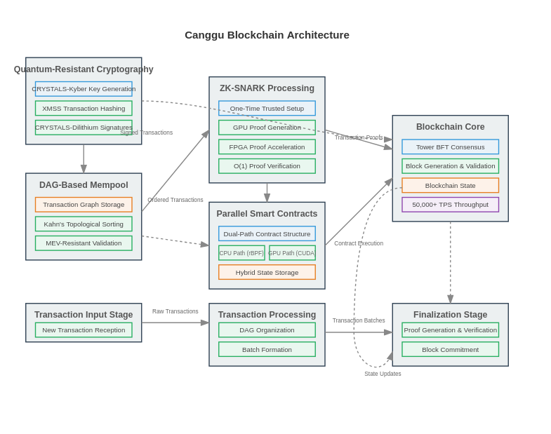

## Block Schematics of Size Blockchain

Here's a comprehensive architectural flowchart that visualizes how the four main components of the Canggu blockchain interact with each other:

Quantum-Resistant Cryptography Module (top left):

Shows the implementation of CRYSTALS-Kyber for key generation
XMSS for transaction hashing
CRYSTALS-Dilithium for digital signatures

DAG-Based Mempool Module (middle left):

Depicts the transaction graph storage
Kahn's topological sorting algorithm
MEV-resistant validation processes

ZK-SNARK Processing Module (top center):

Illustrates the one-time trusted setup
GPU-accelerated proof generation
FPGA proof acceleration
O(1) constant-time verification

Parallel Smart Contracts Module (middle center):

Shows the dual-path contract structure
CPU execution path using rBPF
GPU execution path using CUDA
Hybrid state storage

Blockchain Core (right):

Tower BFT consensus mechanism
Block generation and validation
Blockchain state management
50,000+ TPS throughput capability

The flowchart also illustrates the transaction lifecycle through the system:

Transaction input stage (bottom left)
Transaction processing with DAG organization (bottom center)
Finalization with proof generation and block commitment (bottom right)

The connections between modules show both direct data flows (solid lines) and logical relationships (dashed lines), demonstrating how each component contributes to the overall architecture.
This visualization complements the code schematics by showing how the different technical components fit together in the complete system architecture.
